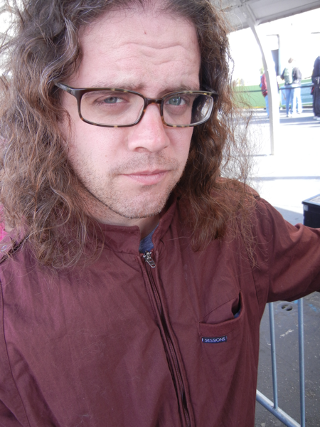



I am a freelance Web, iOS and Mac OS X developer currently living in <a href="https://maps.google.com/maps/place?ftid=0x87523d9488d131ed:0x5b53b7a0484d31ca&q=Salt+Lake+City,+UT&hl=en&ie=UTF8&ll=40.760779,-111.891047&spn=0.00052,0.000687&t=h&z=11&vpsrc=0">Salt Lake City, Utah</a>. I love what I do, I started very young and as I got older, I began to branch out more and explored the world to the point that I felt ready to embrace geekdom professionally for the rest of my life. It took me a few years, but I came back. I'm continually fascinated by technology, I always have been. It was a lot of fun in the 80's on a monochrome Apple IIe, these days it's just ridiculous. Feel free to <a href="#" id="email_contact">get in touch</a>.
  
   </img>

 <ul class="posts">
      
      <li>
          <h3>
              <a href="{{ post.url }}">
                  {{ post.title }}
              </a>
              
                  {{ post.date | date_to_string }}
             
             
             {{ p.url }}
             
         </h3>
     </li>
     
 </ul>

